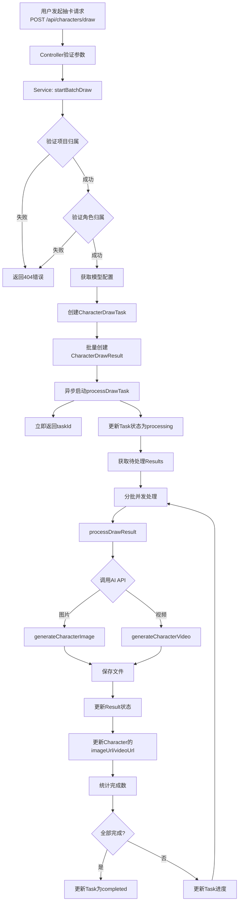
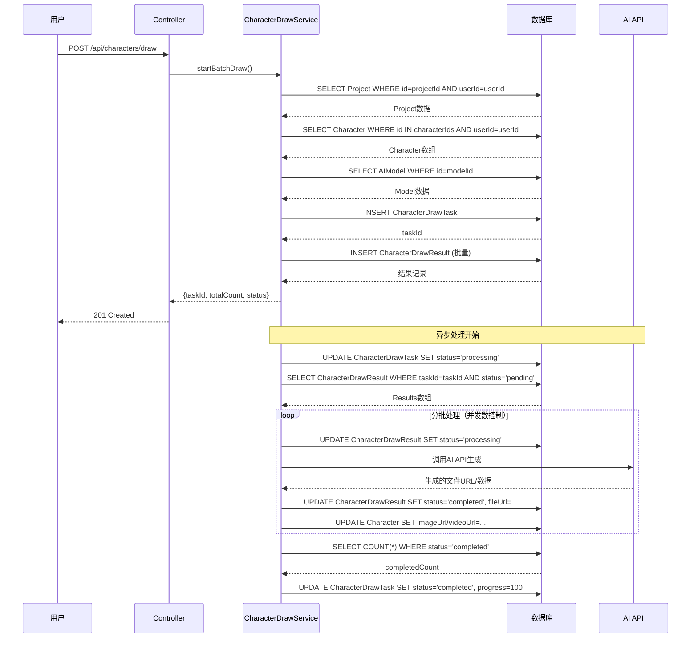

# 角色抽卡流程可视化图表

## 1. 整体流程图



## 2. 数据库交互时序图



## 3. 数据表关系图

```
┌─────────────────┐
│      User       │
│   (用户表)      │
└────────┬────────┘
         │
         │ 1:N
         │
         ▼
┌─────────────────┐      ┌──────────────────────┐
│    Project      │      │  CharacterDrawTask   │
│   (项目表)      │◄─────┤   (抽卡任务表)        │
└─────────────────┘      └──────────┬───────────┘
         │                          │
         │                          │ 1:N
         │                          │
         │                          ▼
         │                 ┌──────────────────────┐
         │                 │ CharacterDrawResult  │
         │                 │   (抽卡结果表)        │
         │                 └──────────┬───────────┘
         │                            │
         │                            │ N:1
         │                            │
         ▼                            ▼
┌─────────────────┐      ┌──────────────────────┐
│   Character     │      │      AIModel          │
│   (角色表)      │      │   (AI模型表)          │
└─────────────────┘      └──────────────────────┘
```

## 4. 状态流转图

### Task 状态流转
```
┌─────────┐
│ pending │ ────创建任务时
└────┬────┘
     │
     ▼
┌─────────────┐
│ processing  │ ────开始处理时
└─────┬───────┘
      │
      ├─────────────┐
      │             │
      ▼             ▼
┌───────────┐  ┌─────────┐
│completed  │  │ failed  │
└───────────┘  └─────────┘
```

### Result 状态流转
```
┌─────────┐
│ pending │ ────创建结果时
└────┬────┘
     │
     ▼
┌─────────────┐
│ processing  │ ────开始生成时
└─────┬───────┘
      │
      ├─────────────┐
      │             │
      ▼             ▼
┌───────────┐  ┌─────────┐
│completed  │  │ failed  │
└───────────┘  └─────────┘
```

## 5. 并发处理流程图

```
待处理结果数组: [R1, R2, R3, R4, R5, R6, R7, R8, R9]
并发数: 3

批次1 (并发执行):
  ┌─────┐  ┌─────┐  ┌─────┐
  │ R1  │  │ R2  │  │ R3  │
  └─────┘  └─────┘  └─────┘
     │        │        │
     └────────┴────────┘
            │
      Promise.all() 等待全部完成

批次2 (并发执行):
  ┌─────┐  ┌─────┐  ┌─────┐
  │ R4  │  │ R5  │  │ R6  │
  └─────┘  └─────┘  └─────┘
     │        │        │
     └────────┴────────┘
            │
      Promise.all() 等待全部完成

批次3 (并发执行):
  ┌─────┐  ┌─────┐  ┌─────┐
  │ R7  │  │ R8  │  │ R9  │
  └─────┘  └─────┘  └─────┘
     │        │        │
     └────────┴────────┘
            │
      Promise.all() 等待全部完成
```

## 6. 关键代码执行路径

### 请求处理路径
```
POST /api/characters/draw
  ↓
characterDrawController.startBatchDraw()
  ↓
characterDrawService.startBatchDraw()
  ├─ 验证项目 (Project表查询)
  ├─ 验证角色 (Character表查询)
  ├─ 获取模型 (AIModel表查询 + Project表获取密钥)
  ├─ 创建任务 (CharacterDrawTask表插入)
  ├─ 创建结果 (CharacterDrawResult表批量插入)
  └─ 异步处理 (processDrawTask)
      ↓
  立即返回 {taskId, totalCount, status}
```

### 异步处理路径
```
processDrawTask(taskId)
  ↓
更新Task状态为 'processing'
  ↓
获取待处理Results
  ↓
分批并发处理:
  for (let i = 0; i < results.length; i += concurrency) {
    batch = results.slice(i, i + concurrency)
    await Promise.all(
      batch.map(result => processDrawResult(result))
    )
  }
  ↓
processDrawResult(result)
  ├─ 更新Result状态为 'processing'
  ├─ 调用AI API (generateCharacterImage/Video)
  ├─ 保存文件到本地
  ├─ 更新Result状态为 'completed'
  └─ 更新Character的imageUrl/videoUrl
  ↓
统计完成数，更新Task状态
```

## 7. 数据流图

```
输入数据流:
  characterIds: ["id1", "id2", "id3"]
  projectId: "project-uuid"
  drawType: "image" | "video" | "both"
  modelId: "model-uuid" (可选)
  config: { width, height, duration, style }
  concurrency: 3

处理过程:
  ┌─────────────────────────────────────┐
  │ 1. 验证和获取配置                    │
  │    - Project数据                    │
  │    - Character数据                  │
  │    - AIModel数据                    │
  │    - API密钥（解密后）               │
  └─────────────────────────────────────┘
           ↓
  ┌─────────────────────────────────────┐
  │ 2. 创建任务和结果记录                 │
  │    - CharacterDrawTask              │
  │      * characterIds: JSON数组        │
  │      * drawType, modelId, config    │
  │      * status: 'pending'             │
  │    - CharacterDrawResult[]           │
  │      * 每个角色每个类型一条记录       │
  │      * status: 'pending'             │
  └─────────────────────────────────────┘
           ↓
  ┌─────────────────────────────────────┐
  │ 3. AI生成和文件保存                   │
  │    - 调用AI API                      │
  │    - 获取生成的文件URL/数据           │
  │    - 保存到本地文件系统               │
  │    - 生成文件路径                    │
  └─────────────────────────────────────┘
           ↓
  ┌─────────────────────────────────────┐
  │ 4. 更新数据库记录                     │
  │    - CharacterDrawResult             │
  │      * fileUrl, filePath             │
  │      * status: 'completed'           │
  │    - Character                      │
  │      * imageUrl 或 videoUrl           │
  └─────────────────────────────────────┘

输出数据流:
  Task: { taskId, totalCount, status }
  Result: { fileUrl, filePath, metadata }
  Character: { imageUrl, videoUrl }
```

## 8. 错误处理流程

```
┌─────────────────────────────────────┐
│ 错误类型和处理方式                    │
└─────────────────────────────────────┘

1. 项目/角色验证失败
   → 返回 404 NotFoundError
   → 不创建任务

2. 模型配置错误
   → 返回 400 AppError
   → 不创建任务

3. 任务处理失败（整体）
   → 更新 CharacterDrawTask.status = 'failed'
   → 记录 errorMessage
   → 不影响已完成的Results

4. 单个结果生成失败
   → 更新 CharacterDrawResult.status = 'failed'
   → 记录 errorMessage
   → 不影响其他Results
   → 继续处理下一个

5. AI API调用失败
   → 在 processDrawResult() 中捕获
   → 更新对应Result为 'failed'
   → 记录错误信息
```

## 9. 性能优化点

1. **批量插入**: CharacterDrawResult 使用 `createMany()` 批量插入
2. **并发控制**: 通过 `concurrency` 参数控制并发数，避免过载
3. **异步处理**: 任务创建后立即返回，不阻塞用户请求
4. **分批处理**: 大量结果时分批处理，避免内存溢出
5. **索引优化**: 数据库表已添加必要的索引（userId, taskId, status等）

## 10. 关键配置说明

- **drawType**:
  - `'image'`: 只生成图片
  - `'video'`: 只生成视频
  - `'both'`: 同时生成图片和视频（总任务数 = 角色数 × 2）

- **concurrency**:
  - 默认值: 3
  - 范围: 1-100
  - 控制同时处理的结果数量

- **modelId**:
  - 如果提供: 使用指定的模型
  - 如果不提供: 使用项目配置的模型（根据drawType选择）

